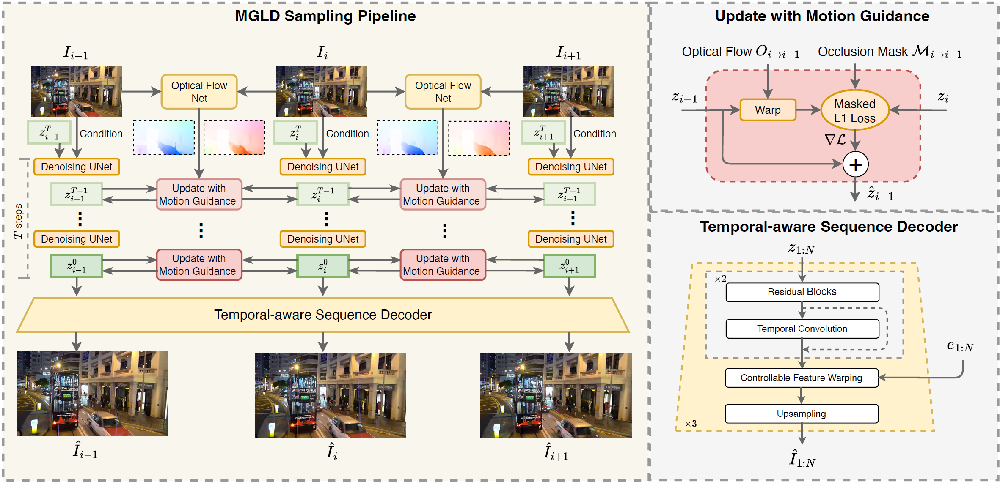
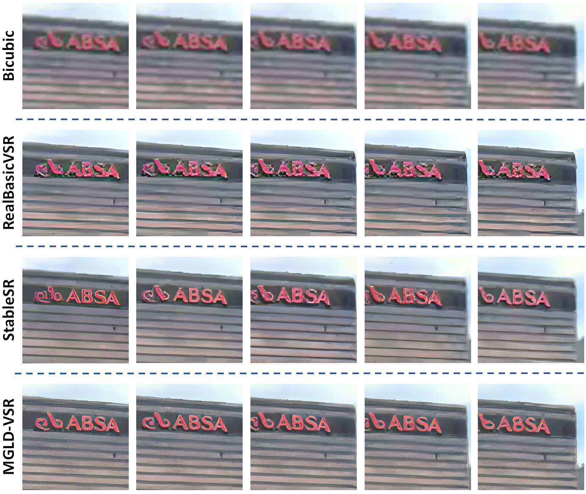
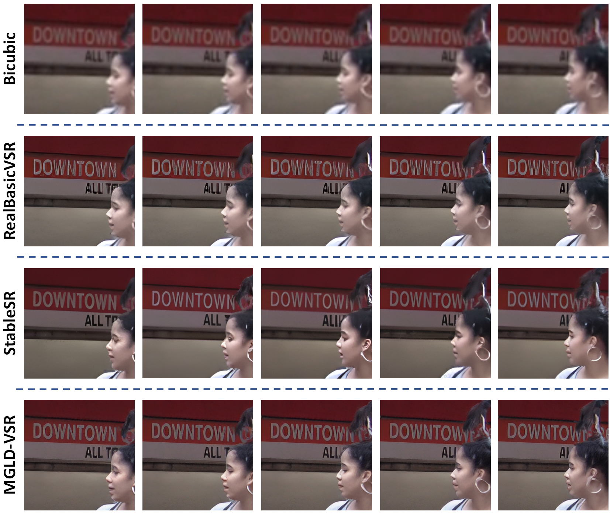
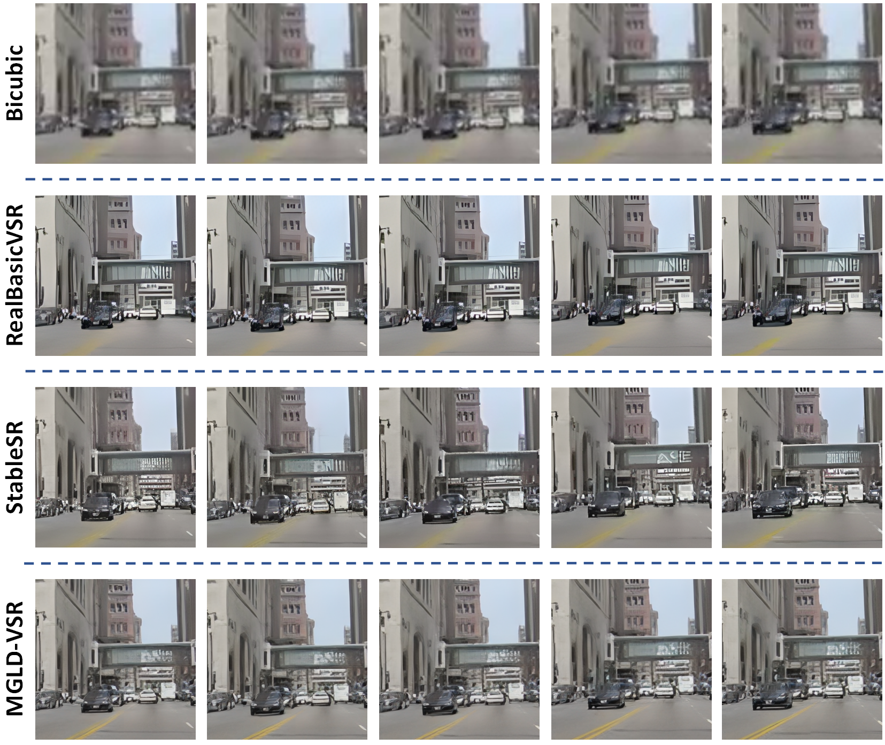

# **Motion-Guided Latent Diffusion for Temporally Consistent Real-world Video Super-resolution**

[](https://arxiv.org/abs/2312.00853)

[Xi Yang](https://scholar.google.com.hk/citations?user=iadRvCcAAAAJ&hl=zh-CN)<sup>1,2</sup> , [Chenhang He](https://skyhehe123.github.io/)<sup>1</sup> , [Jianqi Ma](https://scholar.google.com/citations?user=kQUJjQQAAAAJ&hl=en)<sup>1,2</sup> , [Lei Zhang](https://www4.comp.polyu.edu.hk/~cslzhang/)<sup>1,2</sup>

<sup>1</sup>The Hong Kong Polytechnic University, <sup>2</sup>OPPO Research Institute

## Abstract
Real-world low-resolution (LR) videos have diverse and complex degradations, imposing great challenges on video super-resolution (VSR) algorithms to reproduce their high-resolution (HR) counterparts with high quality. Recently, the diffusion models have shown compelling performance in generating realistic details for image restoration tasks. However, the diffusion process has randomness, making it hard to control the contents of restored images. This issue becomes more serious when applying diffusion models to VSR tasks because temporal consistency is crucial to the perceptual quality of videos. In this paper, we propose an effective real-world VSR algorithm by leveraging the strength of pre-trained latent diffusion models. To ensure the content consistency among adjacent frames, we exploit the temporal dynamics in LR videos to guide the diffusion process by optimizing the latent sampling path with a motion-guided loss, ensuring that the generated HR video maintains a coherent and continuous visual flow. To further mitigate the discontinuity of generated details, we insert temporal module to the decoder and fine-tune it with an innovative sequence-oriented loss. The proposed motion-guided latent diffusion (MGLD) based VSR algorithm achieves significantly better perceptual quality than state-of-the-arts on real-world VSR benchmark datasets, validating the effectiveness of the proposed model design and training strategies.

## Framework Overview


## Updates
- **2023.12.18**: Code and pretrained models are released.
- **2023.12.06**: Repo is released.

## Results
<details>
<summary><strong>Synthetic Results</strong> (click to expand) </summary>


</details>

<details>
<summary><strong>Real-world Results</strong> (click to expand) </summary>


</details>

<details>
<summary><strong>Sequence Comparison</strong> (click to expand) </summary>
  





</details>

<details>
<summary> <strong> Video Comparisons </strong> (click to expand) </summary>
  
  <br><strong> Video Comparison 1 </strong><br>
  
  https://github.com/IanYeung/MGLD-VSR/assets/19669051/3b0f3691-fd21-4bc7-8970-402fe628086b

  <br><strong> Video Comparison 2 </strong><br>

  https://github.com/IanYeung/MGLD-VSR/assets/19669051/8bcb9c5c-f073-402e-93ee-f32b2444463a

  <br><strong> Video Comparison 3 </strong><br>

  https://github.com/IanYeung/MGLD-VSR/assets/19669051/0abff608-a1ba-4efd-9599-502e753c8b26
 
</details>

## Installation
```
# git clone this repository
git clone https://github.com/IanYeung/MGLD-VSR
cd MGLD-VSR

# Create a conda environment and activate it
conda env create --file environment.yaml
conda activate mgldvsr

# Install xformers
conda install xformers -c xformers/label/dev

# Install mmcv
mim install mmcv

# Install taming & clip
pip install -e git+https://github.com/CompVis/taming-transformers.git@master#egg=taming-transformers
pip install -e git+https://github.com/openai/CLIP.git@main#egg=clip
```

## Training and Testing

### Testing
Download the pretrained diffusion denoising U-net and video variational autoencoder from [[BaiduNetDisk](https://pan.baidu.com/s/1xQF996RsxnmN-60ZLB6Vig?pwd=gh4i)] or [[OneDrive](https://connectpolyu-my.sharepoint.com/:f:/g/personal/19046191r_connect_polyu_hk/EvI_j1SUiVFBlwEy4i62ckgB1XEHeqfFcJS4Ho6JQrTAWA?e=rDT4M4)]. Download the VideoLQ dataset following the links [here](https://github.com/ckkelvinchan/RealBasicVSR). Please update the ckpt_path, load_path and dataroot_gt paths in config files. 

Test on arbitrary size with chopping for VAE.
```
python scripts/vsr_val_ddpm_text_T_vqganfin_oldcanvas_tile.py \
  --config configs/mgldvsr/mgldvsr_512_realbasicvsr_deg.yaml \
  --ckpt CKPT_PATH \
  --vqgan_ckpt VQGANCKPT_PATH \
  --seqs-path INPUT_PATH \
  --outdir OUT_DIR \
  --ddpm_steps 50 \
  --dec_w 1.0 \
  --colorfix_type adain \
  --select_idx 0 \
  --n_gpus 1
```

### Training
Download the pretrained Stable Diffusion models from [[HuggingFace](https://huggingface.co/stabilityai/stable-diffusion-2-1-base)]. Please update the ckpt_path, load_path and dataroot_gt paths in config files. 

Train the conditional denoising U-net for diffusion. 
```
python main.py \
  --train \
  --base configs/mgldvsr/mgldvsr_512_realbasicvsr_deg.yaml \
  --gpus GPU_ID \
  --name NAME \
  --scale_lr False
```

Train the temporal-aware sequence decoder. Please set the ckpt_path, load_path and data_root paths in config files. 

You need to first generate training data using the finetuned diffusion model in the first stage. 
```
python scripts/vsr_val_ddpm_text_T_vqganfin_w_latent.py \
  --config configs/mgldvsr/mgldvsr_512_realbasicvsr_deg.yaml \
  --ckpt CKPT_PATH \
  --vqgan_ckpt VQGANCKPT_PATH \
  --seqs-path INPUT_PATH \
  --outdir OUT_DIR \
  --latent-dir LATENT_DIR
  --ddpm_steps 50 \
  --dec_w 1.0 \
  --colorfix_type adain \
  --select_idx 0 \
  --n_gpus 1
```
Then you can train temporal-aware sequence decoder:
```
python main.py \
  --train \
  --base configs/video_vae/video_autoencoder_kl_64x64x4_resi.yaml \
  --gpus GPU_ID, \
  --name NAME \
  --scale_lr False
```

## Miscs

### Citations
```
@article{yang2023mgldvsr,
  title={Motion-Guided Latent Diffusion for Temporally Consistent Real-world Video Super-resolution},
  author={Yang, Xi and He, Chenhang and Ma, Jianqi and Zhang, Lei},
  booktitle={Proceedings of the European Conference on Computer Vision (ECCV)},
  year={2024}
}
```

### Acknowledgement
This implementation largely depends on [StableSR](https://github.com/IceClear/StableSR). We thank the authors for the contribution.
